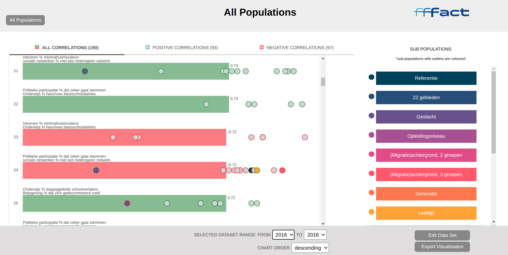

# CIDEr
A prototype Flask/ Bokeh app for visualising data relationships in multi-index datasets. Produced to meet the fffact.nl client brief
Intended as an exploratory tool, for identifying interest cases in a complex multi-index dataset.
I.e.,
- handle multi-index data sets: sub-index auto-detection, zooming to sub-index via side bar
- date period selection (by years)
- (at a glance) colour-coded outlier identification

CREDIT: Chris, Semme, Shi and myself

## Installation
1) clone the github repo

  git clone https://github.com/ryanbrate/CIDEr.git
  
2) Navigate to folder

  cd CIDEr

3) recreate the locked python dependency environment

  pipenv install

## Running the app once installed
1) open terminal in project folder
2) run in terminal ....

  pipenv shell

  python3 app.py

3) navigate to localhost address (see terminal output for location)
